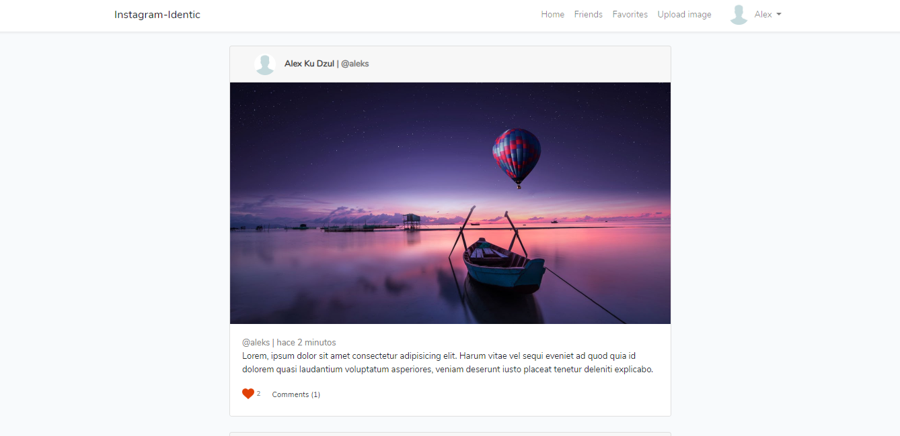

# Laravel Red Social - Similar a Instagram
Aplicación: Laravel Red Social - Similar a Instagram.

Tecnologías:
- Laravel.
- MySql.
- Blade.
- Bootstrap 4

Módulos:
- laravel/ui: `composer require laravel/ui`, `php artisan ui vue --auth`, `npm install && npm run dev`.

Esta app puede:
- Crear/Leer/Actualizar/Eliminar Publicaciones(imagenes).
- Crear/Leer/Actualizar/Eliminar Comentarios.
- Likes y Unlikes de las publicaciones.
- Login y Register.
- Configurar perfil del usuario.
- Buscador de amigos.
- Entre otros

# Screenshot

# Guía de instalación
1. Descarga el repositorio
2. Descomprime la carpeta dentro del directorio que desees (Laragon, Valet, Xampp o WampServer)
3. Renombra la carpeta (Opcional)
4. Entra a la carpeta desde la terminal `cd directorio/de/la/carpeta`
5. Copia el contenido del archivo `.env.example` a un nuevo archivo llamado `.env`
    * Si estás en Linux o Mac puedes ejecutar el comando: `cp .env.example .env`
6. Crea una base de datos para el proyecto
7. Modifica las variables de conexión del nuevo archivo `.env`
    * Define los datos de conexión
        * DB_DATABASE=
        * DB_USERNAME=
        * DB_PASSWORD=
8. Ejecuta `composer install`
9. Ejecuta `php artisan key:generate`
10. Ejecuta `php artisan migrate`
11. Ejecuta `php artisan db:seed`
12. Ejecuta `npm install && npm run dev`, para compilar los estilos del frontend.
13. Abre la aplicación en el navegador
14. Accede a `/login` para ingresar en tu perfil.
    * Email: alex@alex.com
    * Password: 12345678

# License

#### Todos los proyectos creados por Alex Ku Dzul están bajo la [licencia MIT](https://opensource.org/licenses/MIT).
